#  Laboratório 01 - Instalação do Ubuntu 20.04 no Windows Subsystem for Linux 2 (WSL2)

## 1 - Objetivos


Instalar e configurar o Ubuntu 20.04 no Windows Subsystem for Linux 2 (WSL2).

* Windows Subsystem for Linux 2;

## 2 - Pré-requisitos

* Windows 10 versão 2004 ou superior;
* Conhecimento básico da utilização de sistemas Linux;

Este documento assume que você esteja utilizando o Windows 10 versão 2004 ou
superior (Build 19041 ou superior) ou o Windows 11. Caso esteja utilizando uma
versão mais antiga do Windows 10 é recomendavél que você faça a atualização.
Caso não seja possível você ainda poderá instalar o WSL, consulte a referência
[2].

## 3 - Referências

[1] [Instalar o WSL no Windows 10 2004 e superior](https://docs.microsoft.com/pt-br/windows/wsl/install)

[2] [Instalar o WSL no Windows 10 em versões mais antigas](https://docs.microsoft.com/pt-br/windows/wsl/install-manual)

[3] [Conectar dispositivos USB ao WSL](https://devblogs.microsoft.com/commandline/connecting-usb-devices-to-wsl/)

[4] [Configurar um ambiente de desenvolvimento WSL](https://docs.microsoft.com/pt-br/windows/wsl/setup/environment)

## 4 - Instalação do WSL

Para o Windows 10 versão 2004 e superiores o processo de instalação do WSL é
realizado de forma automática. Para isso, abra o *Windows PowerShell* como
administrador.

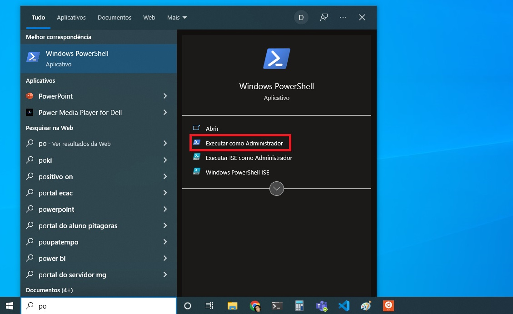

O WSL permite que você escolha, entre as opções disponíveis, a distribuição
Linux de sua preferência. Para ver uma lista das distribuições disponíveis
digite o comando 

```console
PS > wsl --list --online
```

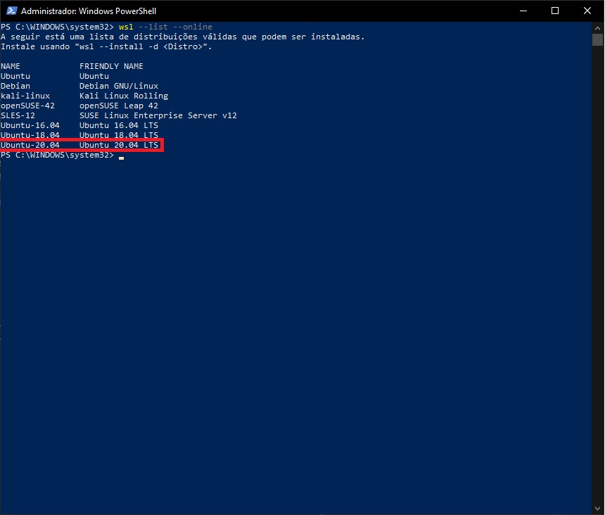

Em seguida, instale a distribuição desejada usando **wsl --install -d <Distro>**.
Neste curso será utilizada a distribuição **Ubuntu 20.04 LTS**. Caso opte por
uma distribuição diferente será necessário adaptar as instruções fornecidas.

```console
PS > wsl --install -d Ubuntu-20.04
```
Quando a instalação terminar será solicitado que você escolha um nome de
usuário e uma senha para este usuário. ATENÇÃO, **não será mostrado **
**nenhum caractere ao digitar a senha**. É assim mesmo, digite a senha e
pressione a tecla *ENTER*.

É boa prática manter o sistema operacional atualizado. Para temos que
atualizar a lista de pacotes, baixar e instalar as atualizações dos
programas instalados. Para realizar esta tarefa iremos utilizar o **apt**
(*Advanced Packaging Tool*), gerenciador de pacotes do Ubuntu.

Os sistemas operacionais baseados no Unix, dos quais o Linux faz parte, têm a
capacidade de definir de forma detalhada os direitos de acesso aos arquivos,
dispositivos e recursos do sistema operacional. Para atualizar o sistema é
necessário direitos de super-usuário (administrador).

Para executar programas e comandos com direitos de acesso de super-usuário
podemos utilizar o comando **sudo**, que significa *super user do!*. As linhas
de comando a seguir atualizam a lista de pacotes e atualizam os programas
instalados:

```console
foo@bar$ sudo apt update
foo@bar$ sudo apt upgrade
```

O *apt* executa com direitos de acesso de super-usuário logo será solicitada
a senha de administrador, criada logo após o a instalação do Ubuntu.

Antes de iniciarmos a instalação das ferramentas necessárias para configuração
do ambiente de desenvolvimento vamos criar um diretório para salvarmos os
arquivos que baixarmos da internet e outro que servirá de espaço de trabalho
para atividades de laboratório.

```console
foo@bar$ cd
foo@bar$ mkdir Downloads
foo@bar$ mkdir semb1-workspace
```

O comando **cd** (*Change Directory*) é utilizado para alterar o diretório
atual. Quando utilizado sem parâmetros o diretório é alterado para a pasta
*home* do usuário. A pasta *home* é o local onde você pode armazenar seus
arquivos pessoais no Linux. Geralmente o diretório *home* possui o caminho
***/home/usuario***. Você pode consultar o caminho do diretório atual
utilizando o comando **pwd**.

O comando **mkdir** (*Make Directory*) é utilizado para criar novos diretórios.
Os comando acima criaram os diretórios ***/home/usuario/Downloads*** e 
***/home/usuario/semb1-workspace***. Utilizaremos o diretório Downloads para
salvar arquivos e programas baixados da internet e o diretório semb1-workspace
para nossas atividades de laboratório.

### 5.1 Acesso do sistema de arquivos do Linux no Windows Explorer

Em algumas situações pode ser necessário acessar algum arquivo do Linux 
utilizando algum aplicativo Windows ou você queira explorar o sistema de
arquivos Linux de forma gráfica. Para as situações como a descrita podemos
montar o sistema de arquivos do Linux como um ***drive*** de rede.

Para montar o sistema de arquivos do Linux abra uma nova janela do Windows
Explorer e digite na barra de endereços ***\\\\wsl$***. Após pressionar a
tecla **ENTER** você terá acesso ao sistema de arquivos do Linux.

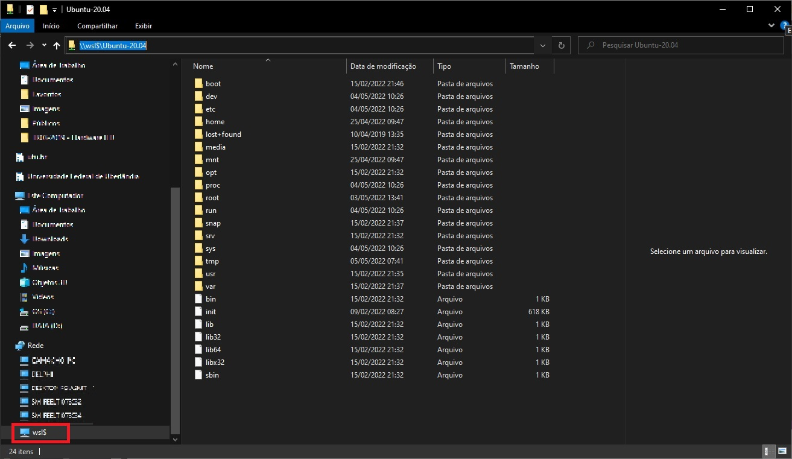

## 5. Configuração do WSL2 para utilização de dispositivos USB

O *Windows Subsytem for Linux* permite que desenvolvedores Windows executem
binários e *scripts* em Linux diretamente no Windows. Entretanto, a ausência
de suporte USB impediu que desenvolvedores de sistemas embarcados adotassem
o WSL.

O USB (*Universal Serial Bus*) é, provavelmente, uma das interfaces de computador
mais importantes para o desenvolvimento de sistemas embarcados. É através desta
interface que gravamos, depuramos o código e testamos o hardware.

No fim de 2021 a Microsoft anunciou que adicionou suporte USB ao WSL [1]
permitindo que todo o ciclo de desenvolvimento de um sistema embarcado seja
realizado diretamente do WSL. As seções seguintes mostram como utilizar o WSL
para gravar um *firmware* no kit de desenvolvimento *STM32F411 Blackpill*.

### 5.1. Instalação do USBIP no WSL2

O suporte à dispositivos USB não é nativo no WSL, é utilizado um sistema de
compartilhamento de dispositivos USB através de uma rede IP denominado USB/IP
ou *USB over IP*. Com o USB/IP é possível compartilhar um dispositivo USB,
seja ele uma câmera, um HD externo, mouse, impressora, ou qualquer outro
dispositivo utilizando uma rede IP.

O USB/IP abstrai uma conexão USB em um dispositivo genérico (servidor) e a
partir daí transmite os pacotes de dados USB pra outro computador (cliente)
via rede. O cliente pode montar seu próprio *USB device* e utilizar os pacotes
de dados USB que recebe via rede.

A Microsoft adicionou suporte ao USB/IP no WSL a partir do kernel 5.10.60.1. 
Assim, devemos primeiramente verificar qual a versão de kernel está instalada
utilizando o comando **uname -a**.

```console
foo@bar$ uname -a
```


Caso sua vesão do kernel seja inferior à requerida abra o *PowerShell* como
administrador e execute o comando **wsl --update**.

Para compartilhar dispositivos USB a partir do Windows precisamos instalar o
servidor do  USB/IP, o **USBIP-WIN**, disponível em [2]. Faça o download e 
execute o arquivo ***usbipd-win_x.msi***. Ao final do processo de instalação teremos

* um serviço chamado *usbipd* (USBIP Device Host);
* uma ferramenta de linha de comando chamada *usbipd*;
* uma regra de *firewall* para permitir que todas as subredes locais conectem ao
serviço *usbipd*.

Após instalar o servidor no Windows devemos instalar o cliente USB/IP e o banco
de dados de identificadores USB no Linux. No Ubuntu devemos instalar os seguintes
pacotes **linux-tools-generic** e **hwdata**.

```console
foo@bar$ sudo apt install linux-tools-generic hwdata
```
Para facilitar a atualização do cliente USB/IP vamos utilizar a ferramenta
**update-alternatives**. Esta ferramenta permite que sejam utilizadas diferentes
versões do cliente USB/IP de forma transparente.

```console
foo@bar$ apt list -a linux-tools-generic
Listing... Done
linux-tools-generic/focal-updates,focal-security,now 5.4.0.113.117 amd64 [installed]
linux-tools-generic/focal 5.4.0.26.32 amd64
foo@bar$ sudo update-alternatives --install /usr/local/bin/usbip usbip /usr/lib/linux-tools/5.4.0-113-generic/usbip 20
```

**ATENÇÃO**: **O comando acima funciona adequadamente para o pacote**
**linux-tools-generic versão 5.4.0-113. Caso a versão instalada do pacote**
**seja diferente linha de comando deverá ser modificada adequadamente.**

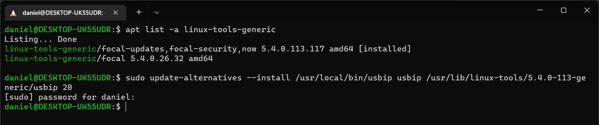

Para maiores informações sobre a ferramenta **update-alternatives**

```console
foo@bar$ man update-alternatives
```

## 6 - Conectar o gravador ST-LINK no WSL2

Antes de conectar o gravador **ST-LINK** na USB certifique-se que o terminal
do Ubuntu está aberto e que o serviço *udev* está rodando.

```console
foo@bar$ sudo service udev restart
```

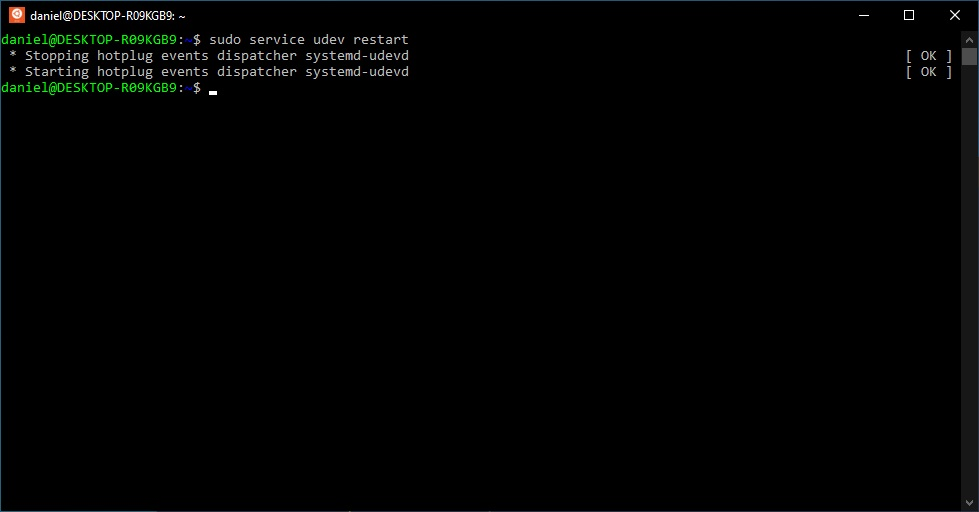

Para utilizar o gravador baixe e instale o *driver* USB do ST-LINK, disponível em
[4]. Conecte o gravador e verifique se o driver foi instalado corretamente. Isto
pode ser feito através do *Gerenciador de Dispositivos*.

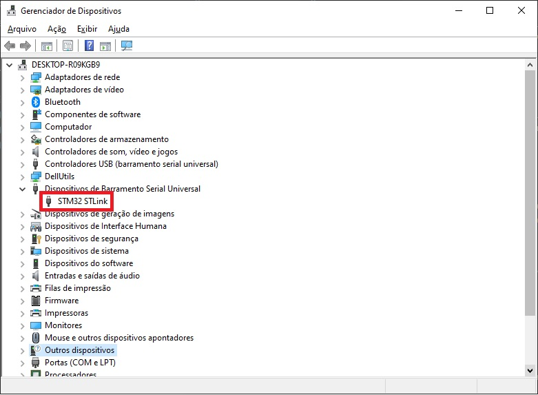

Abra o *Windows PowerShell* como administrador e liste os dispositivos USB conectados.

```console
PS >  usbipd wsl list
```

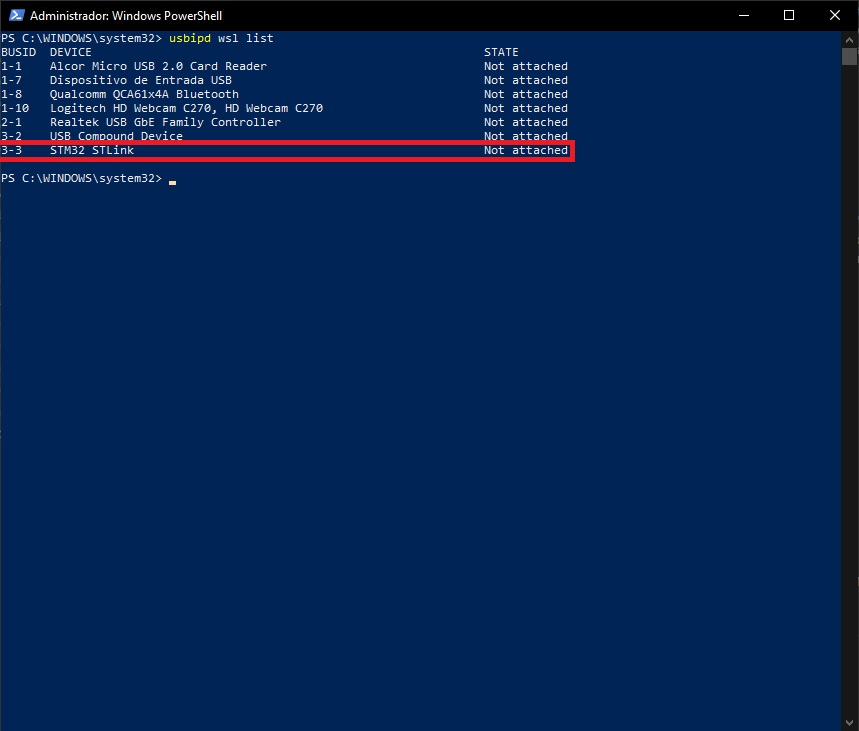

Como podemos observar o gravador ST-LINK possui o **BUSID** 3-3. É importante
ressaltar que o **BUSID** pode mudar de acordo com a porta utilizada para
conectar o **ST-LINK**.

De posse do **BUSID** podemos conectar o gravador ST-LINK ao WSL. Para isso
utilizamos o seguinte comando

```console
PS >  usbipd wsl attach --busid 3-3
PS >  usbipd wsl list
```

Observe que ao listarmos novamente os dispositivos USB vemos que o estado do
gravador ST-LINK foi de **Not attached** para **Attached - Ubuntu-20.04**.

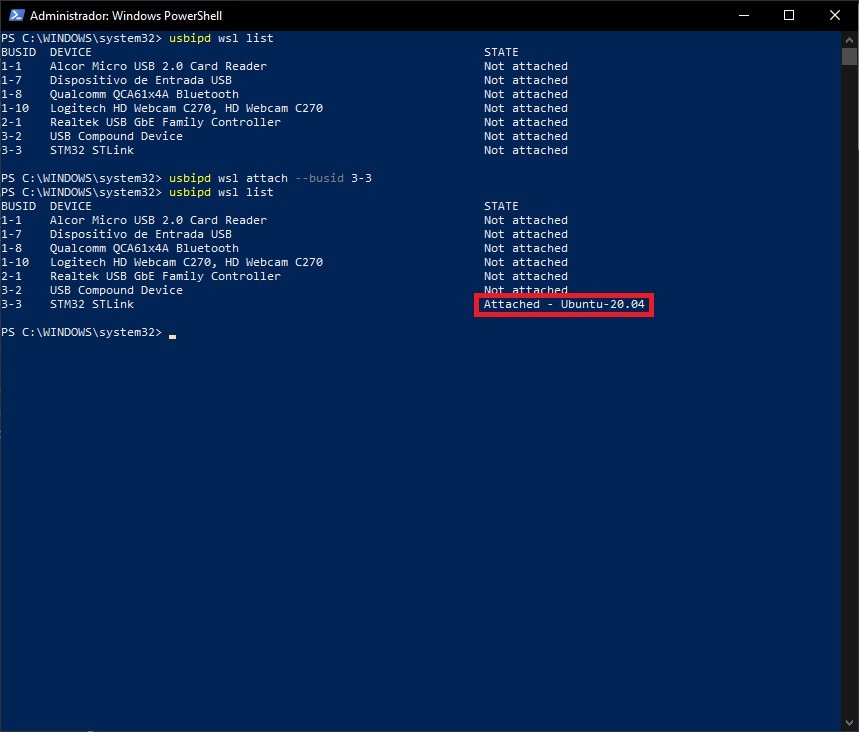

No terminal do Ubuntu verifique, utilizando o comando **lsusb**, se o gravador
ST-LINK está disponível. Observe que o ST-LINK está disponível no **BUS 001** e
**Device 003**.

```console
foo@bar$ lsusb
```
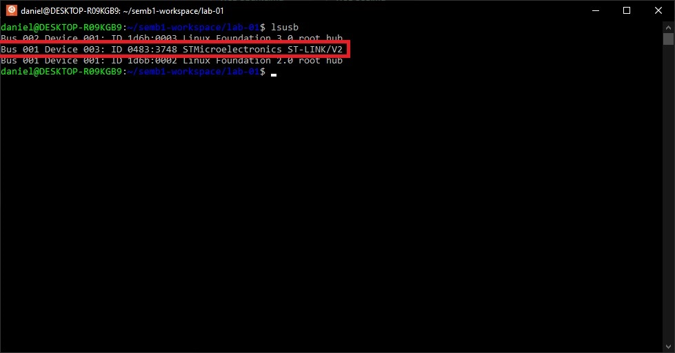

Os sistemas operacionais baseados no Unix, dos quais o Linux faz parte, têm a
capacidade de definir de forma detalhada os direitos de acesso aos arquivos,
dispositivos e recursos do SO. Para verificar se seu usuário tem acesso ao
ST-LINK execute o comando

```console
foo@bar$ ls -l /dev/bus/usb/001/003
```

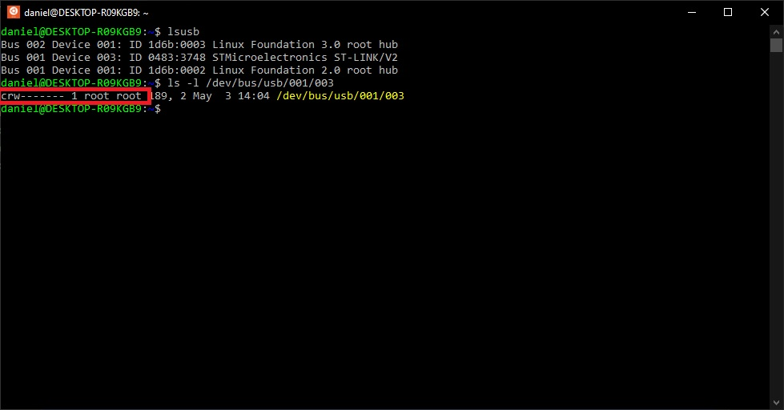

De acordo com a resposta ao comando *ls* este arquivo pertence ao grupo **root**
e ao usuário **root**. Os direitos de acesso a este arquivo são detalhados pelo
conjunto caracteres ```crw-------```. O primeiro caractere indica a natureza do
arquivo que pode ser

* \-: arquivo clássico

* d: diretório

* l: link simbólico

* c: dispositivo do tipo caracter

* b: dispositivo do tipo bloco

* p: pipe (FIFO) ou “tubo”

* s: socket

no nosso caso o arquivo representa um dispositivo tipo caracter, o ST-LINK.

Em seguida, temos 3 grupos com 3 caracteres cada, indicando se o arquivo está
autorizado para leitura, escrita ou execução (read, write e execute). Os 3 
grupos correspondem aos direitos de acesso do proprietário, dos membros do
grupo ao qual o usuário pertence e de outros usuários. As letras ```rwx``` são
usadas para simbolizar essas permissões. Se a permissão não for concedida,
a letra em questão é substituída por -. Para este arquivo apenas o usuário
**root** tem o direito de leitura e escrita. Logo, teremos que alterar os
direitos de acesso a este arquivo para podermos utilizar o ST-LINK.

A melhor forma de alterar os direitos de acesso aos arquivos relacionados à
dispositivos USB é utilizar o **udev**. O **udev** é um subsistema do Linux
para gerenciamento de eventos de dispositivos. Falando de maneira simplificada
o **udev** executa um *script* receber um evento de algum dispositivo, por
exemplo, ao conectarmos um dispositivo USB.

Os ***scripts*** necessários para ajustar os direitos de acesso ao **ST-LINK**
estão na pasta ***lab-01***. Acesse a pasta do laboratório e copies todos os
arquivos do diretório ***config/udev/rules.d*** para o diretório
***/etc/udev/rules.d***

```console
foo@bar$ cd
foo@bar$ cd semb1-workspace/lab-01
foo@bar$ sudo cp config/udev/rules.d/49-stlink* /etc/udev/rules.d
```

Reinicie o servço **udev** e recarregue as regras

```console
foo@bar$ sudo service udev restart
foo@bar$ sudo udevadm control --reload
```

Para verificar se as permissões serão configuradas corretamente desconecte o
ST-LINK do WSL. Vá até o terminal do *PowerShell* e digite

```console
PS >  usbipd wsl detach --busid 3-3
PS >  usbipd wsl list
```

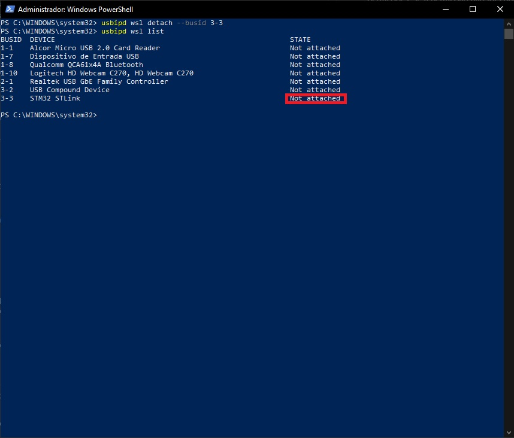

Conecte novamente o ST-LINK ao WSL 

```console
PS >  usbipd wsl attach --busid 3-3
```

vá até o terminal do Ubuntu e verifique os direitos de acesso ao dispostivo.
Observe que o número de dispositivo vinculado ao ST-LINK mudou. Agora ele está
disponível no **BUS 001** e **Device 004**.

```console
foo@bar$ lsusb
foo@bar$ ls -l /dev/bus/usb/001/004
```

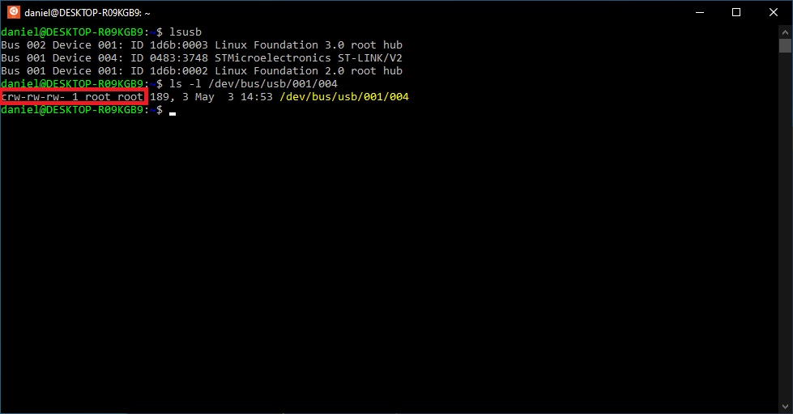

Como pôde notar os direitos de acesso foram alterados de forma que qualquer
usuário tenha acesso a leitura e escrita no dispositivo ST-LINK.

Conecte o programador **ST-LINK**, sem nada conectado a ele, e execute o
seguinte comando

```console
foo@bar$ lsusb
foo@bar$ ls -l /dev/bus/usb/001/004
```

Caso o sistema tenha sido configurado corretamente você deverá obter uma
resposta como a da figura abaixo

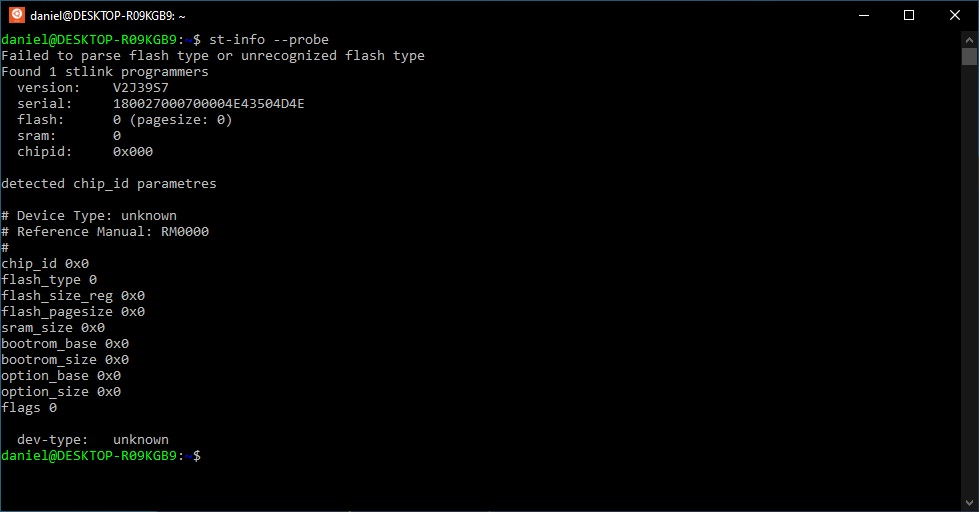