# Laboratório 01 - Roteiro 01

## 1 - Objetivos


Instalar e configurar o Ubuntu 20.04 no Windows Subsystem for Linux 2 (WSL2) como sistema
para desenvolvimento de firmware para microcontroladores da família STM32. Nesta aula
aprenderemos a instalar

* Windows Subsystem for Linux 2;
* GCC - GNU C Compiler;
* GCC ARM Toolchain;
* OpenOCD - Open On Chip Debugger;
* Sistema de controle de versões Git, e;
* Microsoft Visual Studio Code.

## 2 - Pré-requisitos

* Windows 10 versão 2004 ou superior;
* Conhecimento básico da utilização de sistemas Linux;
* ST-LINK *in-circuit debugger and programmer*.

Este documento assume que você esteja utilizando o Windows 10 versão 2004 ou superior
(Build 19041 ou superior) ou o Windows 11. Caso esteja utilizando uma versão mais antiga
do Windows 10 é recomendavél que você faça a atualização. Caso não seja possível você 
ainda poderá instalar o WSL, consulte a referência [3].

## 3 - Referências

[1] [Instalar o WSL no Windows 10 2004 e superior](https://docs.microsoft.com/pt-br/windows/wsl/install)

[2] [Conectar dispositivos USB ao WSL](https://devblogs.microsoft.com/commandline/connecting-usb-devices-to-wsl/)

[3] [Instalar o WSL no Windows 10 em versões mais antigas](https://docs.microsoft.com/pt-br/windows/wsl/install-manual)

[4] [Configurar um ambiente de desenvolvimento WSL](https://docs.microsoft.com/pt-br/windows/wsl/setup/environment)

[5] [GCC online documentation](https://gcc.gnu.org/onlinedocs/)

[6] [GCC ARM Toolchain](https://developer.arm.com/tools-and-software/open-source-software/developer-tools/gnu-toolchain/gnu-rm/downloads)

[7] [Git](https://git-scm.com/)

## 4 - Introdução

Quando se trata de desenvolvimento de softwares para computadores geralmente
podemos utilizar qualquer máquina que possua a mesma arquitetura e execute o
mesmo sistema operacional. Este tipo de desenvolvimento é chamado de 
**desenvolvimento nativo**.

Entretanto, a grande maioria dos sistemas embarcados utilizam arquiteturas
diferentes das arquiteturas utilizadas em computadores. Além disso, estes 
dispositivos geralmente possuem recursos como memória, capacidade de
processamento, etc, bastante limitados. Frequentemente não suportam ou não
utilizam sistemas operacionais, não tem dispositivos de entrada e saída como
teclados, mouses e monitores. Enfim, não é possível a utilização destes
dispositivos para desenvolvimento de software.

Para desenvolver softwares para sistemas embarcados utilizamos um computador
executando um sistema operacional qualquer (Windows, Linux, MacOS) e, por meio
de um pacote de software especializado, compilamos o sotware para a arquitetura
desejada. Este tipo de desenvolvimento é chamado de **cross-platform** e o
processo de compilação é chamado de **cross-compilation**. O pacote de software
utilzado é chamado de **cross-toolchain**, ou apenas **toolchain**. A máquina
onde desenvolvemos a aplicação é chamada de **host** e o dispositivo que irá
executar o binário é chamado de **target**.

Ao longo do nosso curso desenvolveremos softwares que serão executados em
dispositivos, **targets**, com arquitetura **ARM Cortex-M** e utilizaremos como
**host** uma máquina com arquitetura **x86** executando um sistema operacional
Windows, Linux ou MacOS. O pacote de software, **toolchain**, utilizado para
gerar o binário para a arquitetura **ARM Cortex-M** será o
**GCC ARM Toolchain**.

Após compilar o programa você terá uma imagem do binário executável no seu
computador, ainda é necessário uma forma de carregar e executar esta imagem no
sistema embarcado. A imagem do arquivo binário normalmente é carregada em uma
memória na placa do dispositivo ou em uma memória integrada ao microcontrolador.


## 5 - Instalação do WSL

Para o Windows 10 versão 2004 e superiores o processo de instalação do WSL é
realizado de forma automática. Para isso, abra o *Windows PowerShell* como
administrador.


O WSL permite que você escolha, entre as opções disponíveis, a distribuição
Linux de sua preferência. Para ver uma lista das distribuições disponíveis
digite o comando 

```console
PS > wsl --list --online
```


Em seguida, instale a distribuição desejada usando **wsl --install -d <Distro>**.
Neste curso será utilizada a distribuição **Ubuntu 20.04 LTS**. Caso opte por
uma distribuição diferente será necessário adaptar as instruções fornecidas.

```console
PS > wsl --install -d Ubuntu-20.04
```
Quando a instalação terminar será solicitado que você escolha um nome de
usuário e uma senha para este usuário. ATENÇÃO, **não será mostrado **
**nenhum caractere ao digitar a senha**. É assim mesmo, digite a senha e
pressione a tecla *ENTER*.

É boa prática manter o sistema operacional atualizado. Para temos que
atualizar a lista de pacotes, baixar e instalar as atualizações dos
programas instalados. Para realizar esta tarefa iremos utilizar o **apt**
(*Advanced Packaging Tool*), gerenciador de pacotes do Ubuntu.

Os sistemas operacionais baseados no Unix, dos quais o Linux faz parte, têm a
capacidade de definir de forma detalhada os direitos de acesso aos arquivos,
dispositivos e recursos do sistema operacional. Para atualizar o sistema é
necessário direitos de super-usuário (administrador).

Para executar programas e comandos com direitos de acesso de super-usuário
podemos utilizar o comando **sudo**, que significa *super user do!*. As linhas
de comando a seguir atualizam a lista de pacotes e atualizam os programas
instalados:

```console
foo@bar$ sudo apt update
foo@bar$ sudo apt upgrade
```

O *apt* executa com direitos de acesso de super-usuário logo será solicitada
a senha de administrador, criada logo após o a instalação do Ubuntu.

Antes de iniciarmos a instalação das ferramentas necessárias para configuração
do ambiente de desenvolvimento vamos criar um diretório para salvarmos os
arquivos que baixarmos da internet e outro que servirá de espaço de trabalho
para atividades de laboratório.

```console
foo@bar$ cd
foo@bar$ mkdir Downloads
foo@bar$ mkdir semb1-workspace
```

O comando **cd** (*Change Directory*) é utilizado para alterar o diretório
atual. Quando utilizado sem parâmetros o diretório é alterado para a pasta
*home* do usuário. A pasta *home* é o local onde você pode armazenar seus
arquivos pessoais no Linux. Geralmente o diretório *home* possui o caminho
***/home/usuario***. Você pode consultar o caminho do diretório atual
utilizando o comando **pwd**.

O comando **mkdir** (*Make Directory*) é utilizado para criar novos diretórios.
Os comando acima criaram os diretórios ***/home/usuario/Downloads*** e 
***/home/usuario/semb1-workspace***. Utilizaremos o diretório Downloads para
salvar arquivos e programas baixados da internet e o diretório semb1-workspace
para nossas atividades de laboratório.

### 5.1 Acesso do sistema de arquivos do Linux no Windows Explorer

Em algumas situações pode ser necessário acessar algum arquivo do Linux 
utilizando algum aplicativo Windows ou você queira explorar o sistema de
arquivos Linux de forma gráfica. Para as situações como a descrita podemos
montar o sistema de arquivos do Linux como um ***drive*** de rede.

Para montar o sistema de arquivos do Linux abra uma nova janela do Windows
Explorer e digite na barra de endereços ***\\\\wsl$***. Após pressionar a
tecla **ENTER** você terá acesso ao sistema de arquivos do Linux.


## 6 - Instalação do compilador e da ferramenta de controle de versões

Agora, iremos instalar algumas ferramentas básicas que utilizaremos ao longo do
nosso curso, o compilador *GCC - GNU C Compiler* e ferramenta de controle de
versões *Git*. Para instalar estas ferramentas digite o comando abaixo:

```console
foo@bar$ sudo apt install build-essential git
```

Após finalizar o processo de instalação verifique se o **gcc** e o **git**
foram instalados corretamente

```console
foo@bar$ gcc --version
```

```console
foo@bar$ git --version
```

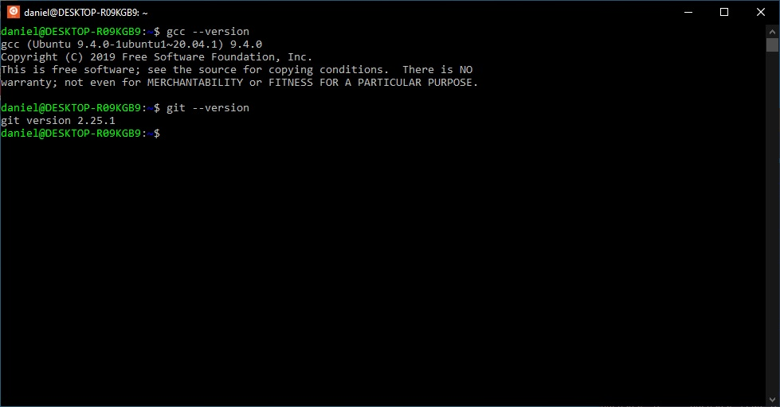

Para poder utilizar o **git** é necessário informar um nome de usuário e um
e-mail:

```console
foo@bar$ git config --global user.name "seu nome aqui"
foo@bar$ git config --global user.email "seu e-mail aqui"
```

Os arquivos necessários para realização das atividades de laboratório serão
dsponibilizados por meio de repositórios **git**. Um repositório, ou repo, é 
um diretório onde os arquivos do seu projeto ficam armazenados. Ele pode ficar
hospedado na nuvem, no GitHub ou no Bitbucket por exemplo, ou em uma pasta no
seu computador. No repositório você pode armazenar códigos, imagens, áudios,
ou qualquer outro arquivo relacionado ao projeto.

Para baixar ou copiar os arquivos de um repositório **git** utilizaremos o
comando **git clone**. O principal objetivo deste comando é obter uma cópia
exata de todos os arquivos de um repositório remoto para um repositório
local. Por padrão, todo o histórico deste repositório é copiado também. Assim,
para baixar os arquivos necessário para o **Laboratório-01** execute os
seguintes comandos:

```console
foo@bar$ cd semb1-workspace
foo@bar$ git clone https://github.com/daniel-p-carvalho/ufu-semb1-lab-01.git lab-01
```

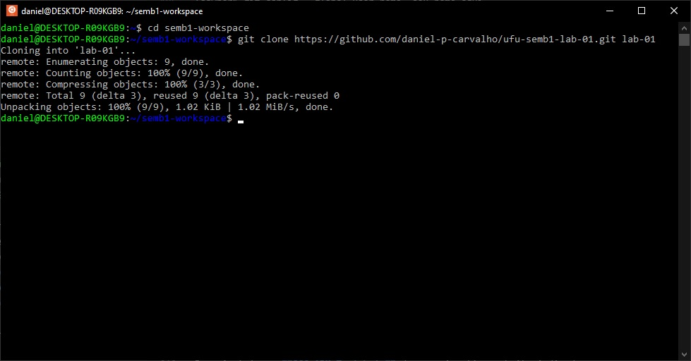

O comando acima *clonou* o conteúdo do repositório remoto
[ufu-semb1-lab-01.git](https://github.com/daniel-p-carvalho/ufu-semb1-lab-01.git)
no diretório **lab-01**. Você pode utilizar o comando **ls** para se certificar
que o diretório foi criado corretamente.

```console
foo@bar$ ls -l
```

Maiores informações sobre o comando **ls** digite:

```console
foo@bar$ man ls
```

## 7 - GCC ARM Toolchain

Para instalar o **GCC ARM Toolchain** devemos ir até o website indicado na
referência [6] e baixar o arquivo com uma versão pré-compilada do *toolchain*
para Linux. Na ocasião da escrita deste texto a última versão disponível era
de outubro de 2021. Copie o endereço do link
[gcc-arm-none-eabi-10.3-2021.10-x86_64-linux.tar.bz2](https://developer.arm.com/-/media/Files/downloads/gnu-rm/10.3-2021.10/gcc-arm-none-eabi-10.3-2021.10-x86_64-linux.tar.bz2).

Em seguida navegue até o diretório Downloads e baixe o **toolchain**

```console
foo@bar$ cd
foo@bar$ cd Downloads
foo@bar$ wget \
https://developer.arm.com/-/media/Files/downloads/gnu-rm/10.3-2021.10/gcc-arm-none-eabi-10.3-2021.10-x86_64-linux.tar.bz2
```

Após o término do download descompacte o arquivo no diretório ***/usr/share***.

```console
foo@bar$ sudo tar xjf gcc-arm-none-eabi-10.3-2021.10-x86_64-linux.tar.bz2 -C /usr/share/
```

Para facilitar a utilização vamos criar links simbólicos dos programas fornecidos pelo
**toolchain** no diretório ***/usr/bin/***

```console
foo@bar$ sudo ln -s /usr/share/gcc-arm-none-eabi-10.3-2021.10/bin/* \
> /usr/bin/
```

Por fim, precisamos instalar as dependências necessárias para a utilização do **toolchain**

```console
foo@bar$ sudo apt install libncurses-dev libtinfo-dev
foo@bar$ sudo ln -s /usr/lib/x86_64-linux-gnu/libncurses.so.6 \
> /usr/lib/x86_64-linux-gnu/libncurses.so.5
foo@bar$ sudo ln -s /usr/lib/x86_64-linux-gnu/libtinfo.so.6 \
> /usr/lib/x86_64-linux-gnu/libtinfo.so.5
```

Podemos testar se o *toolchain* foi instalada correntamente por meio dos comandos:

```console
foo@bar$ arm-none-eabi-gcc --version
foo@bar$ arm-none-eabi-g++ --version
foo@bar$ arm-none-eabi-gdb --version
```

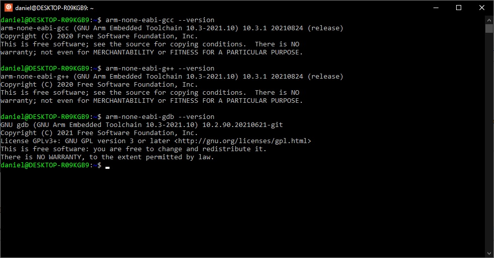

## 8 - Instalação das ferramentas de gravação e depuração de código

### 8.1 - Instalação do OpenOCD

Para instalar o OpenOCD podemos utilizar o gerenciador de pacotes do Ubuntu,
**apt**. Entretanto, a versão do OpenOCD que é instalada utilizando o **apt** é
antiga, versão 0.10.0-6. Iremos utilizar a versão 0.11.0 que possui um suporte
melhorado aos dispostivos STM32 e ao gravador ST-LINK. Logo, vamos compilar o
OpenOCD a partir do código fonte.

Para entender e executar o processo de compilação é muito importante que você leia 
atentamente as instruções contidas no arquivo README. De maneira geral podemos
compilar o OpenOCD executando os passos abaixo.

A primeira coisa que iremos fazer é remover qualquer instalação exstente do OpenOCD

```console
foo@bar$ sudo apt remove openocd
```

Para compilar o OpenOCD é necessário alguns pacotes adicionais são eles:

* make (instalado);
* libtool;
* pkg-config >= 0.23 (ou compatível).

Para compilar a partir de um repositório GIT também precisamos dos pacotes:

* autoconf >= 2.69;
* automake >= 1.14;
* texinfo >= 5.0.

Gravadores que utilizam a intergace USB também dependem da

* libusb-1.0.

Estes pacotes podem ser instalados através do comando

```console
foo@bar$ sudo apt install libtool pkg-config autoconf automake texinfo libusb-1.0-0-dev
```

Em seguida, clone o código fonte do OpenOCD utilizando a ferramenta de controle de
versões **git**

```console
foo@bar$ cd
foo@bar$ cd Downloads
foo@bar$ git clone https://git.code.sf.net/p/openocd/code openocd-code
```

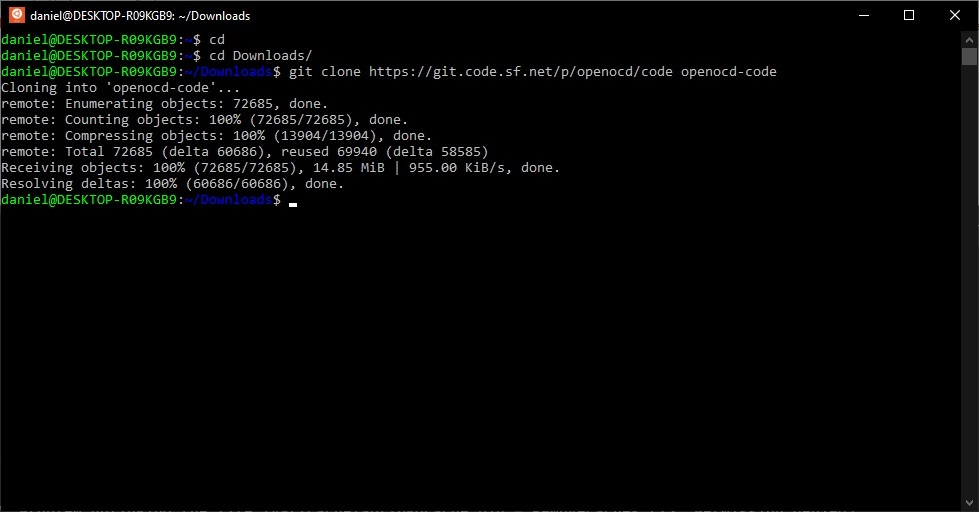

```console
foo@bar$ cd openocd-code
foo@bar$ git tag
```

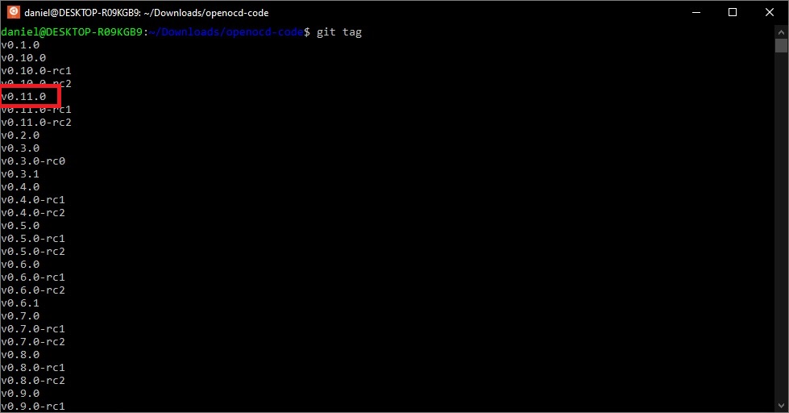

Desejamos utilizar a versão *v0.11.0* portanto, devemos trocar para este *tag*.

```console
foo@bar$ git switch -c v0.11.0
```

Agora, podemos compilar o **OpenOCD** utilizando a seguinte sequência de comandos

```console
foo@bar$ ./bootstrap
```

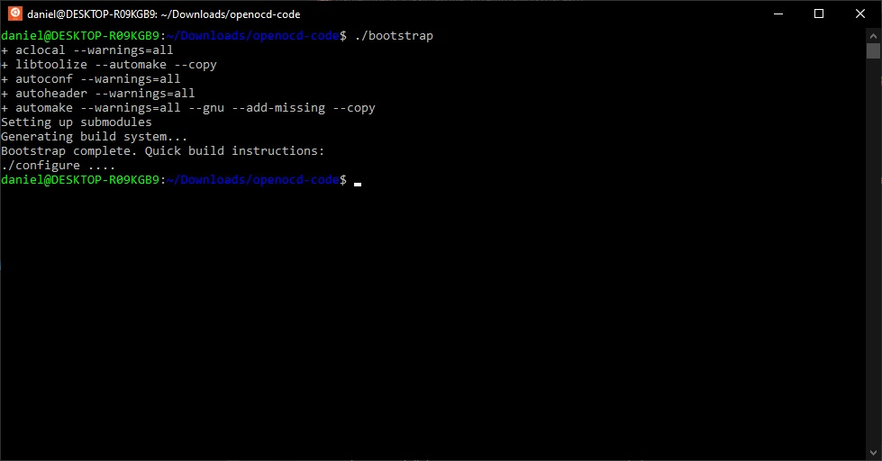

```console
foo@bar$ ./configure --enable-stlink
```

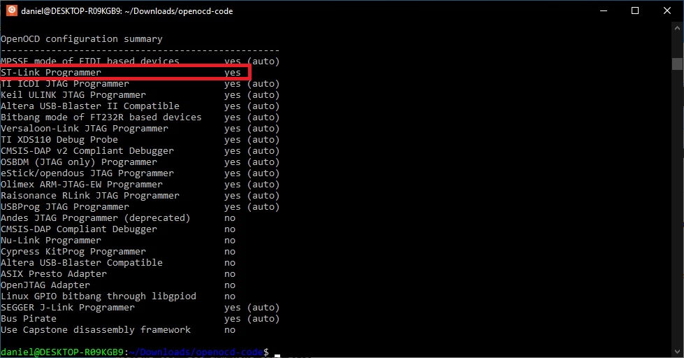

```console
foo@bar$ make
foo@bar$ sudo make install
```

Para verificar se o **OpenOCD** foi instalado corretamente utilizamos o comando

```console
foo@bar$ openocd --version
```

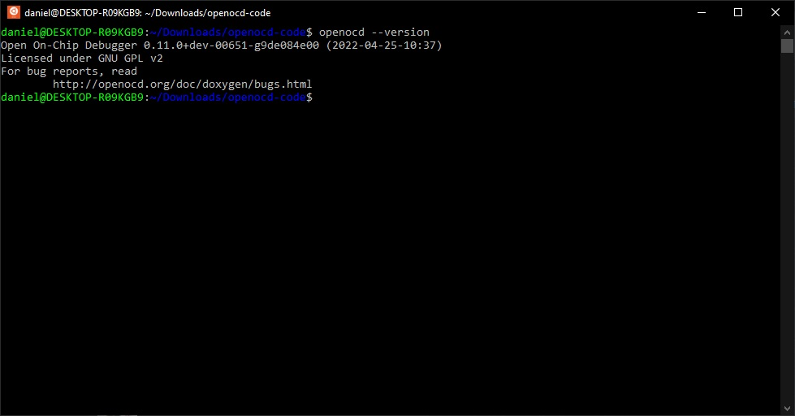

### 8.2 - Ferramentas de código aberto ST-LINK

As ferramentas de código aberto ST-LINK também podem ser utilizadas para
gravar e depurar programas desenvolvidos para dispositivos *STM32*. Iremos
utilizar as seguintes aplicações:

* **st-info** - a programmer and chip information tool
* **st-flash** - a flash manipulation tool
* **st-util** - a GDB server (supported in Visual Studio Code / VSCodium via the Cortex-Debug plugin)

As ferramentas **stlink** podem ser instaladas utilizando o utilitário **apt**.

```console
foo@bar$ sudo apt install stlink-tools
```

A versão disponibilizada pelo **apt** é antiga logo, iremos optar por compilar
a versão estável mais recente disponibilizada no repositório oficial 
[stlink-org](https://github.com/stlink-org/stlink). Informações detalhadas de
como compilar as ferramentas podem ser obtidas na documentação disponiblizada no
repositório. 

Antes de compilar e instalar as ferramentas **stlink** do repositório oficial
certifique-se de remover a versão instalada utilizando o gerenciado de pacotes

```console
foo@bar$ sudo apt remove stlink-tools
```

Navegue até o diretório *Downloads* e clone o repositório

```console
foo@bar$ cd
foo@bar$ cd Downloads
foo@bar$ git clone https://github.com/stlink-org/stlink stlink-tools
```

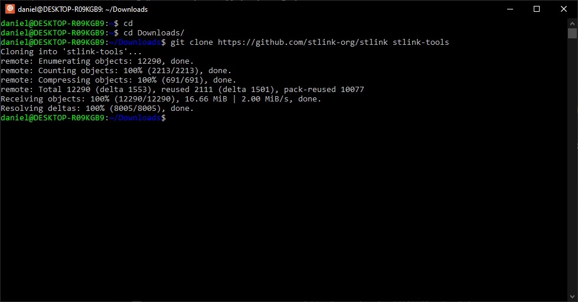

Para compilar as ferramentas **stlink** é necessário instalar os pacotes a
seguir:

* git;
* gcc (provavelmente instalado);
* build-essential (distribuições baseadas no Debian como o Ubuntu);
* cmake;
* libusb-1.0;
* libusb-1.0-0-dev (arquivos de cabeçalho utilizados na compilação);
* libgtk-3-dev (opcional, utilizada para a aplicação stlink-gui);
* pandoc (opcional, needed for generating manpages from markdown)

Iremos instalar apenas os pacotes necessários

```console
foo@bar$ sudo apt install git build-essential cmake libusb-1.0-0 libusb-1.0-0-dev
```

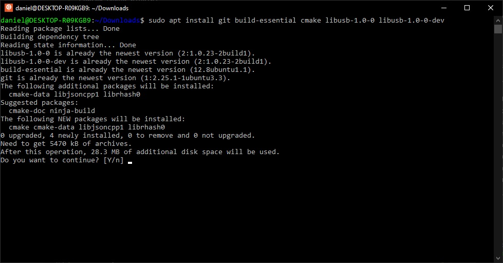

Navegue até o diretório do código fonte e liste as versões estáveis disponíveis:

```console
foo@bar$ cd stlink-tools
foo@bar$ git tag
```

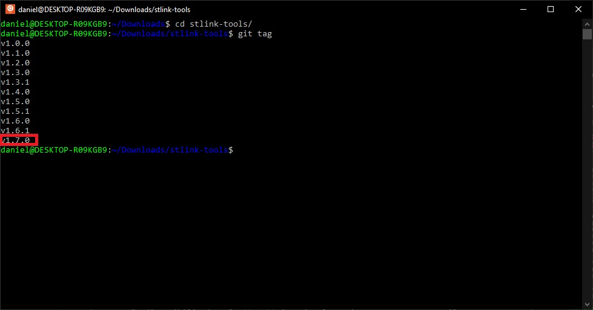

Desejamos compilar a versão estável mais recente logo, necessitamos alterar
o *branch* para a *tag* da versão desejada:

```console
foo@bar$ git switch -c v1.7.0
```

Para compilar e instalar as ferramentas **stlink** execute os seguintes comandos

```console
foo@bar$ make clean
foo@bar$ make release
foo@bar$ sudo make install
```

Pode ser necessário atualizar as bibliotecas de vínculo dinâmico do sistema. Para isso execute o comando **ldconfig**

```console
foo@bar$ sudo ldconfig
```

Verifique se as ferramentas **stlink** foram instaladas corretamente

```console
foo@bar$ st-flash --version
foo@bar$ st-info --version
foo@bar$ st-trace --version
foo@bar$ st-util --version
```

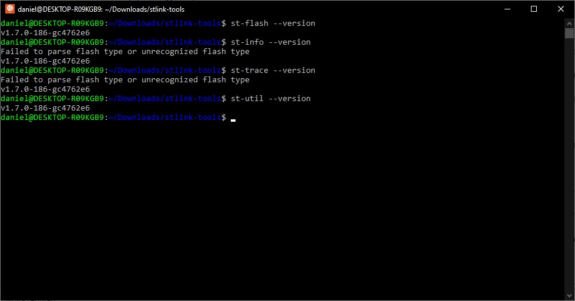

### 8.3 - Instalação do IDE Visual Studio Code

O **Visual Studio Code** (VS Code) é um Ambiente de Desenvolvimento Integrado
(*Integrated Development Environment - IDE*) de código aberto desenvolvido
pela Microsoft disponível para Windows, Mac e Linux.

O **VS Code** a princípio é uma ferramenta simples e leve e tem como 
funcionalidades básicas:

* edição de código com suporte a várias linguagens de programação;
* terminal de comandos integrado;
* controle de versão;

Estas funcionalidades podem ser facilmentes estendidas utilizando a loja de
extensões.

Vamos utilizar a versão para **Windows** do **VS Code** que pode ser facilmente
integrado ao **WSL** utilizando extensções. Para instalar o **VS Code** faça o
*download* do arquivo do instalador em https://code.visualstudio.com/download
e siga as instruções para a instalação. Ao término do processo de instalação
abra o **VS Code**. Caso deseje instale o pacote de idiomas
**Portuguese Brazil**.

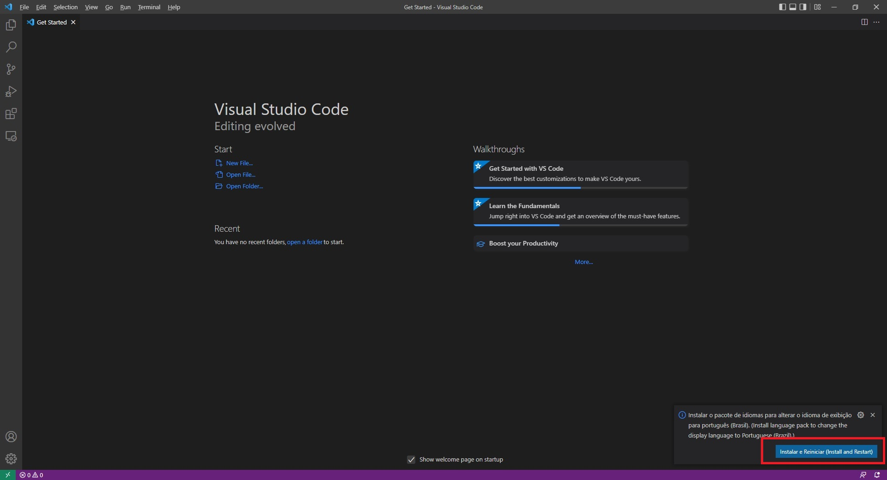

Agora vamos utilizar as extensões para customizar o **VS Code** para acessar o
**WSL** e adicionar ferramentas para edição e depuração de códigos em linguagem
C.

Abra a loja de extensões do **VS Code** clicando no ícone *Extensions* ou 
utilizando as teclas de atalho **CTRL + SHIFT + X** pesquise pela extensão 
**Remote - WSL** e realize a instalação. Pode ser necessário reiniciar o
**VS Code**.

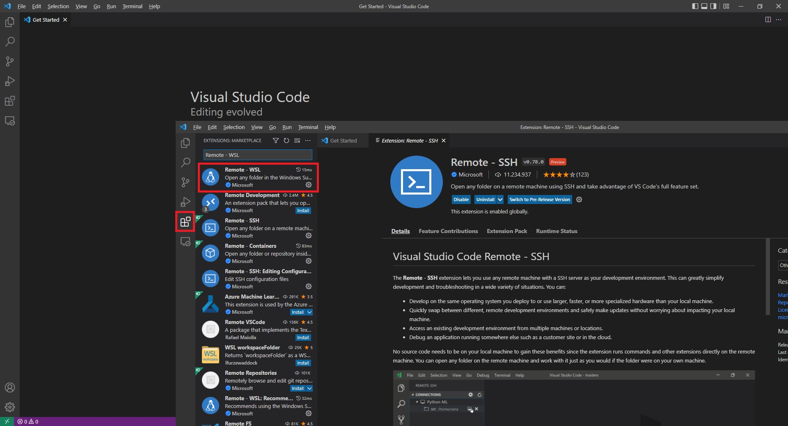

Para instalar as ferramentas de suporte à edição de código em Linguagem C
pesquise na loja de extensões por **C/C++** e instale as seguintes extensões

* C/C++;
* C/C++ Extension Pack; e,
* C/C++ Themes.

Observe na seção *Overview and tutorials* que existem diversos *links* para
exemplos e tutoriais de como utilizar a extensão.

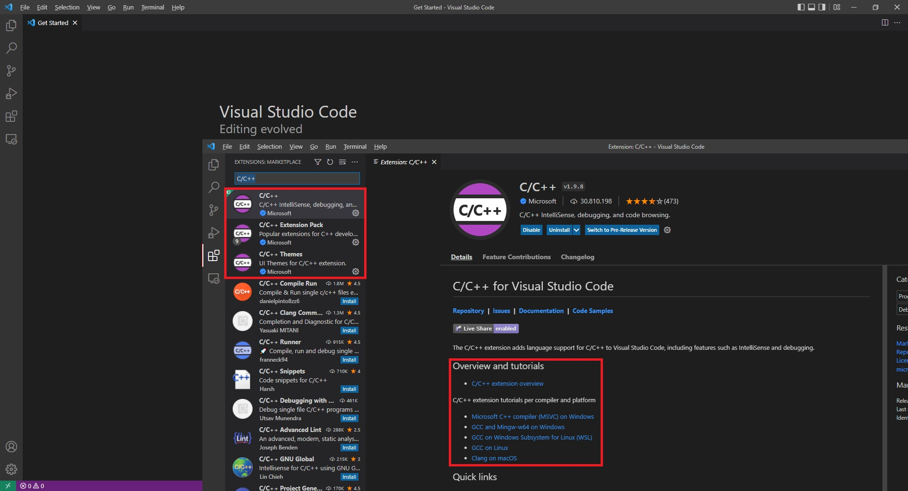

Instale também a ferramenta para depuração de dispositivos *ARM Cortex-M*.
Pesquise na loja de extensões por **Cortex-Debug** e instale a extensão

* **Cortex-Debug**

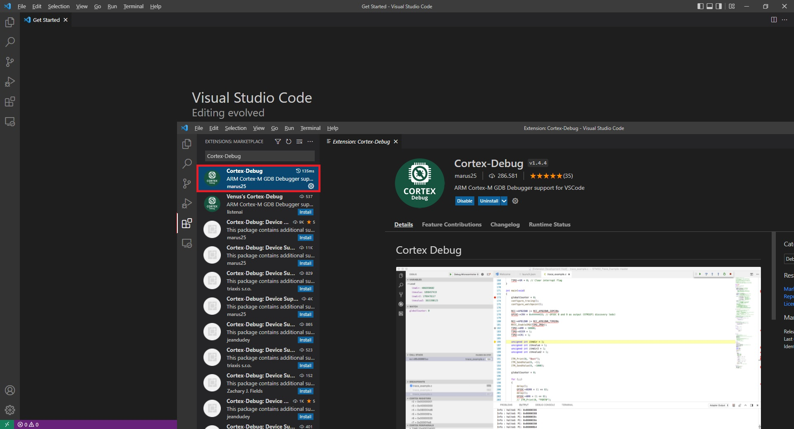

Para utilizar o **VS Code** em conjunto com o **WSL** clique no ícone verde, no
canto inferior esquerdo, e abra uma nova janela remota do **VS Code**.

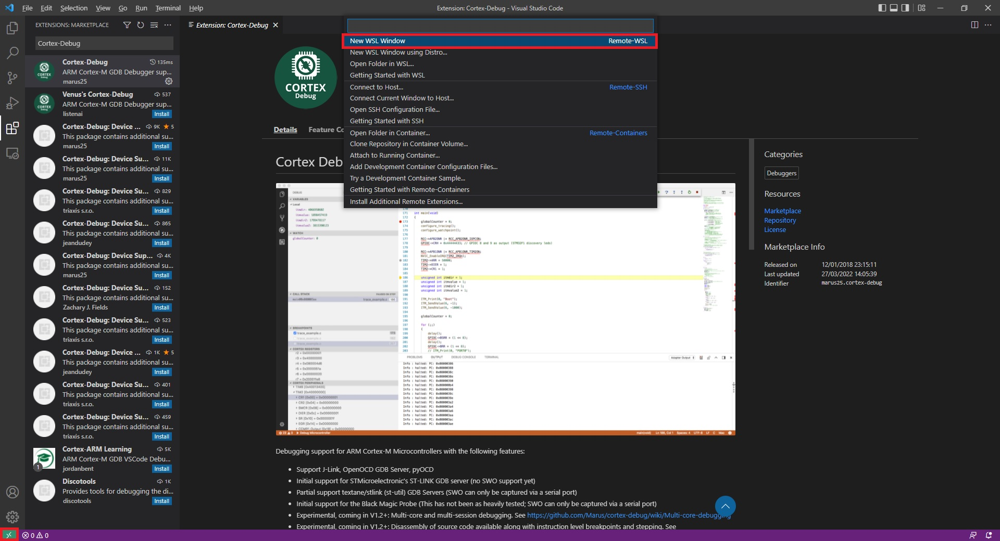

Na nova janela do **VS Code** abra loja de extensões e instale no **WSL** as
extensões instalaladas localmente. Selecione

* C/C++;
* C/C++ Extension Pack;
* C/C++ Themes; e,
* **Cortex-Debug**.

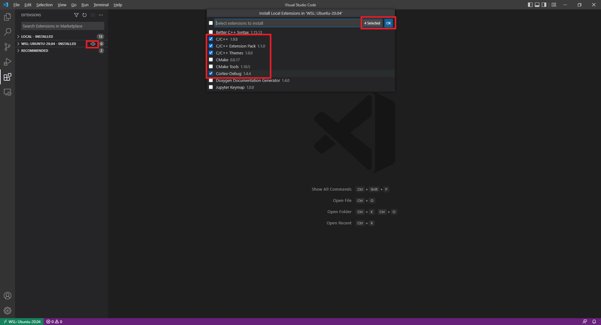

